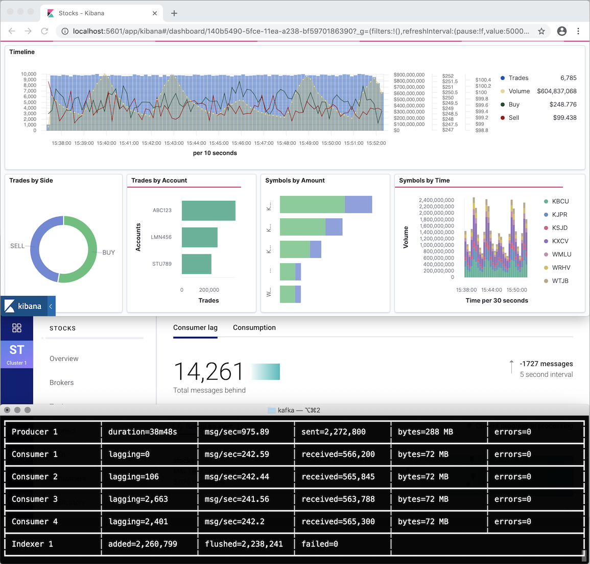

# Example: Bulk indexing from a Kafka topic

This example demonstrates using the `BulkIndexer` component to ingest data consumed from a Kafka topic.

The provided `docker-compose.yml` file launches a realistic environment with Zookeeper, Kafka, Confluent Control Center, Elasticsearch and Kibana, and allows to inspect data flows, indexer metrics, and see the ingested data in a dashboard.

First, launch the environment and wait until it's ready:

    make setup

Then, launch the Kafka producers and consumers and the Elasticsearch indexer:

    make run

Open the [_Kibana_ dashboard](http://localhost:5601/app/kibana#/dashboard/140b5490-5fce-11ea-a238-bf5970186390) to see the results, the [_Kibana_ APM application](http://localhost:5601/app/apm#/services/kafka/transactions?rangeFrom=now-15m&rangeTo=now&refreshPaused=true&refreshInterval=0&transactionType=indexing) to see the indexer metrics, and [_Confluent Control Center_](http://localhost:9021/) to inspect the Kafka cluster and see details about the topic and performance of consumers.

See the [`producer/producer.go`](producer/producer.go) file for the Kafka producer, [`consumer/consumer.go`](consumer/consumer.go) for the Kafka consumer, and the [`kafka.go`](kafka.go) file for the main workflow. The default configuration will launch one producer, four consumers, one indexer, and will send 1,000 messages per second; see `go run kafka.go --help` for changing the defaults.
