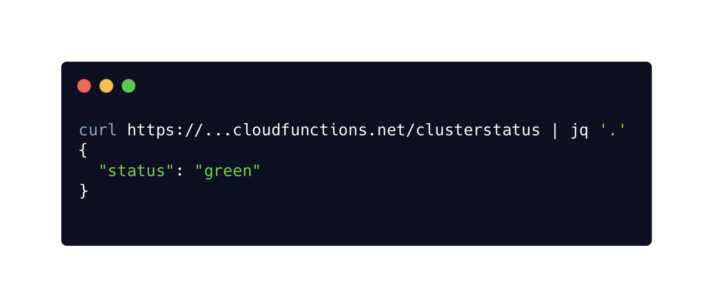

# Example: clusterstatus

This example demonstrates how to use the Elasticsearch Go client with
[_Google Cloud Functions_](https://cloud.google.com/functions/docs/concepts/go-runtime).

 

Deploy the function with the **`gcloud`** command:

```
$ go mod vendor
$ gcloud functions deploy clusterstatus \
	    --entry-point Health \
	    --runtime go111 \
	    --trigger-http \
	    --memory 128MB \
	    --set-env-vars ELASTICSEARCH_URL=https://...cloud.es.io:9243
```

Invoke your function over HTTP:

```
$ curl https://...cloudfunctions.net/clusterstatus
```

See the **[`function.go`](./function.go)** file for implementation and the **[`function_test.go`](./function_test.go)** file for the example of implementing a mock transport for testing.
