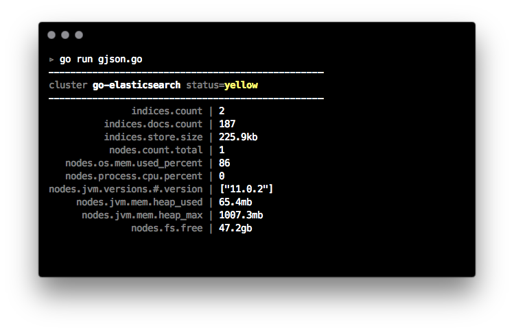

# Example: encoding

Examples in this folder demonstrate how to use helper methods and third-party packages for JSON decoding and encoding.

## `tidwall/gjson`

The [`github.com/tidwall/gjson`](https://github.com/tidwall/gjson) package allows an
easy access to JSON properties, without parsing the payload into a data structure,
and is therefore convenient when accessing only selected parts of the response.

``` golang
var json = `{"foo":{"bar":"BAZ"}}`
fmt.Println(gjson.Get(json, "foo.bar"))
// => BAZ
```

The [**`gjson.go`**](./gjson.go) example displays data from the
[_Cluster Stats_](https://www.elastic.co/guide/en/elasticsearch/reference/current/cluster-stats.html) API.

```
go run gjson.go
```



## `mailru/easyjson`

The [`github.com/mailru/easyjson`](https://github.com/mailru/easyjson) package uses code generation to
provide fast encoding and decoding of struct types.

The [**`easyjson.go`**](./easyjson.go) example uses custom types for representing simple`Article` documents
and index and search responses, including error responses.

```
make clean setup
go run easyjson.go
```

## `esutil.JSONReader()`

The [`esutil.JSONReader()`](../../esutil/json_reader.go) helper method takes a struct, a map,
or any other serializable object, and converts it to JSON wrapped in a reader, for convenient
passing to the `WithBody()` methods:

```golang
type Document struct{ Title string }
doc := Document{Title: "Test"}
es.Search(es.Search.WithBody(esutil.NewJSONReader(&doc)))
```

-----

### Benchmarks

Both `mailru/easyjson` and `tidwall/gjson` provide significant performance gains in different scenarios.

You can run the included benchmarks by executing the `make bench` command; example output below.

```
BenchmarkEncode/Article_-_json         	  500000	      2969 ns/op	     856 B/op	       8 allocs/op
BenchmarkEncode/Article_-_JSONReader   	  500000	      2957 ns/op	     920 B/op	      10 allocs/op
BenchmarkEncode/Article_-_easyjson     	 1000000	      1089 ns/op	     736 B/op	       5 allocs/op
BenchmarkEncode/map_-_json             	 1000000	      2074 ns/op	     720 B/op	      18 allocs/op
BenchmarkEncode/map_-_JSONReader       	 1000000	      2168 ns/op	     784 B/op	      20 allocs/op

BenchmarkDecode/Search_-_json          	   50000	     38922 ns/op	    8456 B/op	      60 allocs/op
BenchmarkDecode/Search_-_easyjson      	  100000	     14344 ns/op	    7992 B/op	      52 allocs/op
BenchmarkDecode/Cluster_-_json_-_map   	   20000	     85742 ns/op	   31972 B/op	     391 allocs/op
BenchmarkDecode/Cluster_-_json_-_stc   	   30000	     50852 ns/op	   15048 B/op	      17 allocs/op
BenchmarkDecode/Cluster_-_gjson        	 1000000	      2284 ns/op	     264 B/op	       3 allocs/op
```
