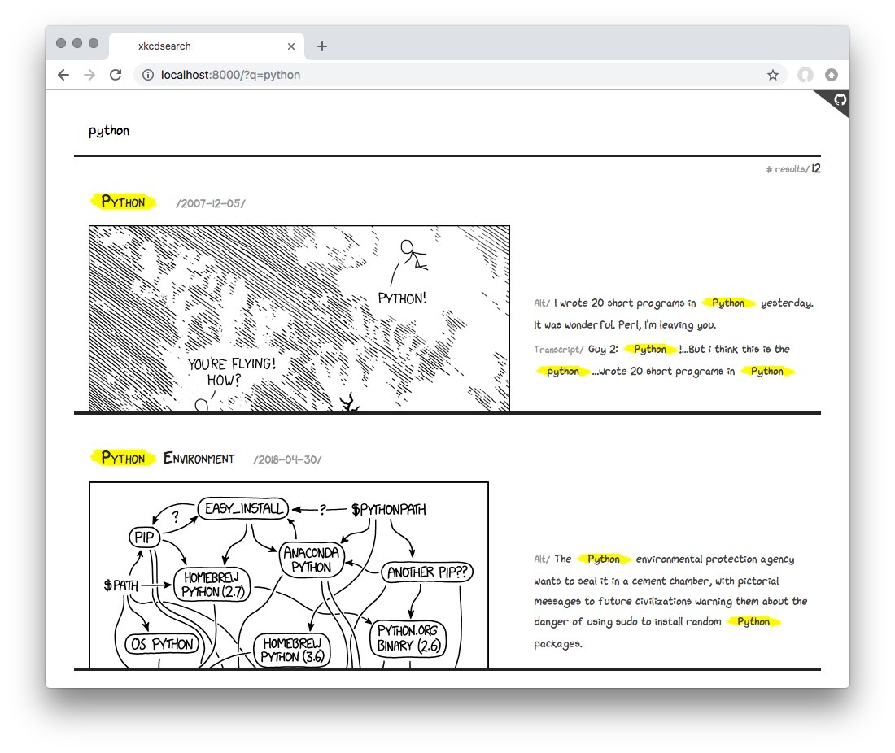

# Example: xkcdsearch

This example demonstrates how to use the Elasticsearch Go client to implement a small command-line utility and web application.

The utility fetches information from the [xkcd.com](xkcd.com) JSON API, indexes it into Elasticsearch, and provides both a command-line and web interface to search the data. See a live version at <https://xkcd-golang.app.elstc.co>.

Run the main executable to list the options:

    go run cmd/xkcd/main.go

To index the data into Elasticsearch, run:

    go run cmd/xkcd/main.go index

To use the command-line search interface, run:

    go run cmd/xkcd/main.go search python

To launch the web application, run:

    go run cmd/xkcd/main.go server

The **[`store.go`](./store.go)** file demonstrates how to embed `elasticsearch.Client` in a custom type, build queries, perform requests, and parse the responses while handling total results, highlighted fields, etc.

The **[`store_test.go`](./store_test.go)** file demonstrates how to mock the client for unit testing a component.
