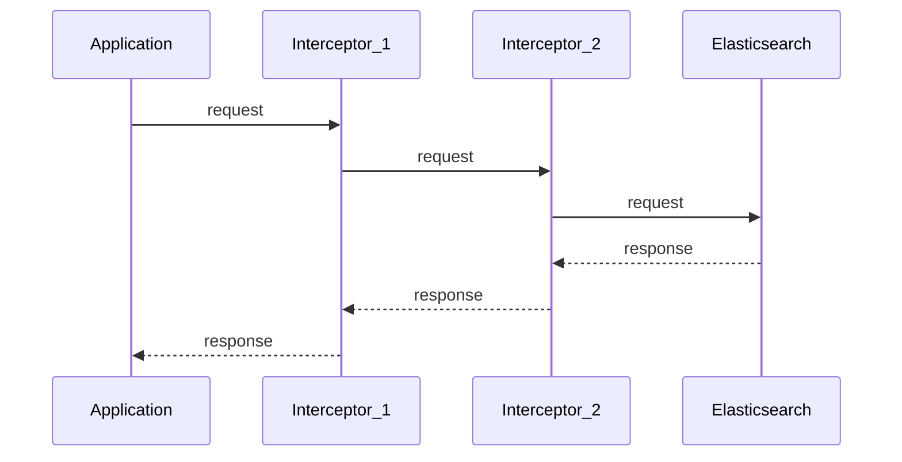

# Interceptors [interceptors]

Interceptors are middleware functions that can modify HTTP requests and responses on every call to {{es}}. They are useful for injecting authentication credentials, adding custom headers, implementing observability, and handling challenge-response authentication protocols.

## How interceptors work [_how_interceptors_work]

An interceptor wraps the transport's round-trip function. It receives the next function in the chain and returns a new function that can modify the request before calling `next`, and modify the response after.

The type signatures are defined in the `elastictransport` package:

```go
type RoundTripFunc func(*http.Request) (*http.Response, error)

type InterceptorFunc func(next RoundTripFunc) RoundTripFunc
```

Interceptors are configured in `elasticsearch.Config` and applied at client creation. They cannot be changed after the transport is created.

```go
es, err := elasticsearch.NewClient(elasticsearch.Config{
    Interceptors: []elastictransport.InterceptorFunc{
        myFirstInterceptor(),
        mySecondInterceptor(),
    },
})
```

### Execution order [_interceptor_execution_order]

Interceptors are applied **left to right** for requests and **right to left** for responses. In the example above:

1. `myFirstInterceptor` modifies the request first
2. `mySecondInterceptor` modifies the request second, then sends it to {{es}}
3. `mySecondInterceptor` sees the response first
4. `myFirstInterceptor` sees the response last



## Dynamic credential rotation [_interceptor_auth_provider]

When credentials may change at runtime — for example, during token refresh or credential rotation — an interceptor can inject the latest credentials into each request dynamically.

```go
func DynamicAuthInterceptor(provider *CredentialProvider) elastictransport.InterceptorFunc {
    return func(next elastictransport.RoundTripFunc) elastictransport.RoundTripFunc {  // <1>
        return func(req *http.Request) (*http.Response, error) {
            username, password := provider.Get()  // <2>
            req.SetBasicAuth(username, password)   // <3>
            return next(req)                       // <4>
        }
    }
}
```

1. Wrap the next function in the chain.
2. Retrieve the latest credentials at call time.
3. Set the `Authorization` header on the outgoing request.
4. Pass the request to the next interceptor (or transport).

The `CredentialProvider` uses a `sync.RWMutex` so credentials can be updated safely from another goroutine:

```go
type CredentialProvider struct {
    mu       sync.RWMutex
    username string
    password string
}

func (p *CredentialProvider) Get() (string, string) {
    p.mu.RLock()
    defer p.mu.RUnlock()
    return p.username, p.password
}

func (p *CredentialProvider) Update(username, password string) {
    p.mu.Lock()
    defer p.mu.Unlock()
    p.username = username
    p.password = password
}
```

Usage:

```go
authProvider := NewCredentialProvider("user1", "password1")

es, err := elasticsearch.NewClient(elasticsearch.Config{
    Addresses: []string{"https://localhost:9200"},
    Interceptors: []elastictransport.InterceptorFunc{
        DynamicAuthInterceptor(authProvider),
    },
})

// Later, rotate credentials — all future requests use the new credentials
authProvider.Update("user2", "password2")
```

## Per-request auth via context [_interceptor_context_auth]

In multi-tenant applications or impersonation scenarios, different requests may need different credentials. An interceptor can read credentials from the request's `context.Context`:

```go
type basicAuthKey struct{}

type basicAuthValue struct {
    username string
    password string
}

// WithBasicAuth attaches credentials to a context.
func WithBasicAuth(ctx context.Context, username, password string) context.Context {
    return context.WithValue(ctx, basicAuthKey{}, basicAuthValue{username, password})
}

func ContextAuthInterceptor() elastictransport.InterceptorFunc {
    return func(next elastictransport.RoundTripFunc) elastictransport.RoundTripFunc {
        return func(req *http.Request) (*http.Response, error) {
            if auth, ok := req.Context().Value(basicAuthKey{}).(basicAuthValue); ok {
                req.SetBasicAuth(auth.username, auth.password)  // <1>
            }
            return next(req)  // <2>
        }
    }
}
```

1. Override credentials only if the context contains them.
2. Requests without context credentials proceed with the client's default auth.

Usage:

```go
es, err := elasticsearch.NewClient(elasticsearch.Config{
    Username: "default_user",
    Password: "default_password",
    Interceptors: []elastictransport.InterceptorFunc{
        ContextAuthInterceptor(),
    },
})

// Uses default credentials
es.Info()

// Uses per-request credentials
ctx := WithBasicAuth(context.Background(), "tenant_a", "tenant_a_secret")
es.Info(es.Info.WithContext(ctx))
```

:::{dropdown} Challenge-response authentication (Kerberos/SPNEGO)
:open: false

Interceptors can also handle challenge-response protocols. The following example implements Kerberos/SPNEGO authentication by retrying a request when a 401 challenge is received:

```go
func KerberosInterceptor(tokenProvider func() (string, error)) elastictransport.InterceptorFunc {
    return func(next elastictransport.RoundTripFunc) elastictransport.RoundTripFunc {
        return func(req *http.Request) (*http.Response, error) {
            resp, err := next(req)  // <1>
            if err != nil {
                return nil, err
            }

            if resp.StatusCode == http.StatusUnauthorized {
                authHeader := resp.Header.Get("WWW-Authenticate")
                if strings.HasPrefix(authHeader, "Negotiate") {
                    resp.Body.Close()  // <2>

                    token, err := tokenProvider()  // <3>
                    if err != nil {
                        return nil, fmt.Errorf("failed to obtain Kerberos token: %w", err)
                    }

                    retryReq := req.Clone(req.Context())
                    retryReq.Header.Set("Authorization", "Negotiate "+token)
                    return next(retryReq)  // <4>
                }
            }

            return resp, nil
        }
    }
}
```

1. Send the initial request without authentication.
2. Close the 401 response body before retrying.
3. Obtain a Kerberos token (in production, use a library like `gokrb5`).
4. Retry the request with the `Authorization: Negotiate` header.

:::

:::{dropdown} Custom observability via interceptors
:open: false

While the client has [built-in OpenTelemetry support](observability.md), interceptors can add custom observability. Here is a logging interceptor that records request and response details:

```go
func LoggingInterceptor() elastictransport.InterceptorFunc {
    logger := slog.New(slog.NewTextHandler(os.Stdout, nil))

    return func(next elastictransport.RoundTripFunc) elastictransport.RoundTripFunc {
        return func(req *http.Request) (*http.Response, error) {
            start := time.Now()

            logger.Info("elasticsearch request started",
                slog.String("method", req.Method),
                slog.String("url", req.URL.String()),
            )

            resp, err := next(req)
            duration := time.Since(start)

            if err != nil {
                logger.Error("elasticsearch request failed",
                    slog.Duration("duration", duration),
                    slog.String("error", err.Error()),
                )
                return nil, err
            }

            logger.Info("elasticsearch request completed",
                slog.Int("status_code", resp.StatusCode),
                slog.Duration("duration", duration),
            )

            return resp, nil
        }
    }
}
```

You can compose multiple interceptors for logging, metrics, and tracing:

```go
es, err := elasticsearch.NewClient(elasticsearch.Config{
    Interceptors: []elastictransport.InterceptorFunc{
        LoggingInterceptor(),
        MetricsInterceptor(requestCounter, requestDuration),
        TracingInterceptor(tracer),
    },
})
```

::::{note}
Prefer using the built-in [OpenTelemetry instrumentation](observability.md) over custom interceptors for observability when possible. The built-in support follows OpenTelemetry semantic conventions and provides richer span attributes.
::::

:::

## Best practices [_interceptor_best_practices]

- **Keep interceptors lightweight.** Interceptors run on every request. Avoid expensive operations like disk I/O or network calls inside the hot path.
- **Ordering matters.** Place authentication interceptors before observability interceptors so that traces capture the final request state.
- **Always call `next`.** Failing to call `next(req)` will prevent the request from reaching {{es}}. Only skip `next` if you intentionally want to short-circuit (e.g., returning a cached response).
- **Close response bodies on retry.** If your interceptor retries a request (like the Kerberos example), always close the original response body to avoid resource leaks.
- **Use `req.Clone()` for retries.** When retrying, clone the request to avoid mutating the original.
- **Handle errors from `next`.** If `next` returns an error, return it to the caller rather than swallowing it.
