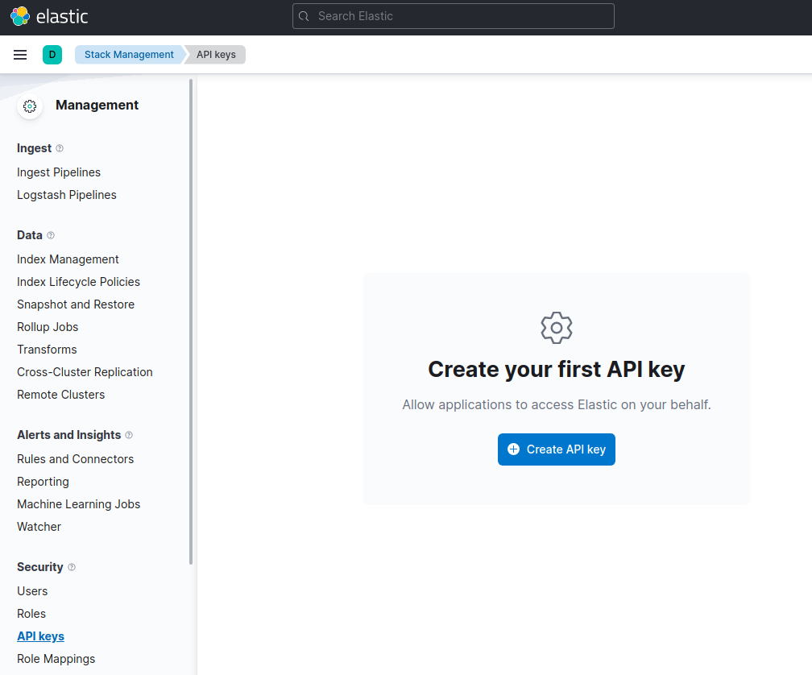

---
mapped_pages:
  - https://www.elastic.co/guide/en/elasticsearch/client/go-api/current/getting-started-go.html
---

# Getting started [getting-started-go]

This page guides you through the installation process of the Go client, shows you how to instantiate the client, and how to perform basic Elasticsearch operations with it. You can use the client with either a low-level API or a fully typed API. This getting started shows you examples of both APIs.

## Requirements [_requirements]

Go version 1.24+

## Installation [_installation]

To install the latest version of the client, run the following command:

```shell subs=true
go get github.com/elastic/go-elasticsearch/v{{ version.elasticsearch-client-go | M }}@latest
```

Refer to the [_Installation_](/reference/installation.md) page to learn more.

## Connecting [_connecting]

:::::::{tab-set}
:group: APIs
::::::{tab-item} Low-level API
:sync: lowLevel
You can connect to the Elastic Cloud using an API key and the Elasticsearch endpoint for the low level API:

```go
client, err := elasticsearch.NewClient(elasticsearch.Config{
    CloudID: "<CloudID>",
    APIKey: "<ApiKey>",
})
```

::::::

::::::{tab-item} Fully-typed API
:sync: typed
You can connect to the Elastic Cloud using an API key and the Elasticsearch endpoint for the fully-typed API:

```go
typedClient, err := elasticsearch.NewTypedClient(elasticsearch.Config{
    CloudID: "<CloudID>",
    APIKey:  "<ApiKey>",
})
```

::::::

:::::::
Your Elasticsearch endpoint can be found on the **My deployment** page of your deployment:


You can generate an API key on the **Management** page under Security.



For other connection options, refer to the [_Connecting_](/reference/connecting.md) section.

## Operations [_operations]

Time to use Elasticsearch! This section walks you through the basic, and most important, operations of Elasticsearch. For more operations and more advanced examples, refer to the [Using the API](/reference/using-the-api/index.md) section.

### Creating an index [_creating_an_index]

:::::::{tab-set}
:group: APIs
::::::{tab-item} Low-level API
:sync: lowLevel
This is how you create the `my_index` index with the low level API:

```go
client.Indices.Create("my_index")
```

::::::

::::::{tab-item} Fully-typed API
:sync: typed
This is how you create the `my_index` index with the fully-typed API:

```go
typedClient.Indices.Create("my_index").Do(context.TODO())
```

::::::

:::::::

### Indexing documents [_indexing_documents]

:::::::{tab-set}
:group: APIs
::::::{tab-item} Low-level API
:sync: lowLevel
This is a simple way of indexing a document by using the low-level API:

```go
document := struct {
    Name string `json:"name"`
}{
    "go-elasticsearch",
}
data, _ := json.Marshal(document)
client.Index("my_index", bytes.NewReader(data))
```

::::::

::::::{tab-item} Fully-typed API
:sync: typed
This is a simple way of indexing a document by using the fully-typed API:

```go
document := struct {
    Name string `json:"name"`
}{
    "go-elasticsearch",
}
typedClient.Index("my_index").
        Id("1").
        Request(document).
        Do(context.TODO())
```

::::::

:::::::

### Getting documents [_getting_documents]

:::::::{tab-set}
:group: APIs
::::::{tab-item} Low-level API
:sync: lowLevel
You can get documents by using the following code with the low-level API:

```go
client.Get("my_index", "id")
```

::::::

::::::{tab-item} Fully-typed API
:sync: typed
This is how you can get documents by using the fully-typed API:

```go
typedClient.Get("my_index", "id").Do(context.TODO())
```

::::::

:::::::

### Searching documents [_searching_documents]

:::::::{tab-set}
:group: APIs
::::::{tab-item} Low-level API
:sync: lowLevel
This is how you can create a single match query with the low-level API:

```go
query := `{ "query": { "match_all": {} } }`
client.Search(
    client.Search.WithIndex("my_index"),
    client.Search.WithBody(strings.NewReader(query)),
)
```

::::::

::::::{tab-item} Fully-typed API
:sync: typed
This is how you can perform a single match query with the fully-typed API:

```go
typedClient.Search().
    Index("my_index").
    Request(&search.Request{
        Query: &types.Query{MatchAll: &types.MatchAllQuery{}},
    }).
    Do(context.TODO())
```

::::::

:::::::

### Updating documents [_updating_documents]

:::::::{tab-set}
:group: APIs
::::::{tab-item} Low-level API
:sync: lowLevel
This is how you can update a document, for example to add a new field, by using the low-level API:

```go
client.Update("my_index", "id", strings.NewReader(`{"doc": {"language": "Go"}}`))
```

::::::

::::::{tab-item} Fully-typed API
:sync: typed
This is how you can update a document with the fully-typed API:

```go
typedClient.Update("my_index", "id").
    Request(&update.Request{
        Doc: json.RawMessage(`{"language": "Go"}`),
    }).Do(context.TODO())
```

::::::

:::::::

### Deleting documents [_deleting_documents]

:::::::{tab-set}
:group: APIs
::::::{tab-item} Low-level API
:sync: lowLevel

```go
client.Delete("my_index", "id")
```

::::::

::::::{tab-item} Fully-typed API
:sync: typed

```go
typedClient.Delete("my_index", "id").Do(context.TODO())
```

::::::

:::::::

### Deleting an index [_deleting_an_index]

:::::::{tab-set}
:group: APIs
::::::{tab-item} Low-level API
:sync: lowLevel

```go
client.Indices.Delete([]string{"my_index"})
```

::::::

::::::{tab-item} Fully-typed API
:sync: typed

```go
typedClient.Indices.Delete("my_index").Do(context.TODO())
```

::::::

:::::::

## Further reading [_further_reading]

- Learn more about the [_Typed API_](/reference/typed-api/index.md), a strongly typed Go API for {{es}}.
