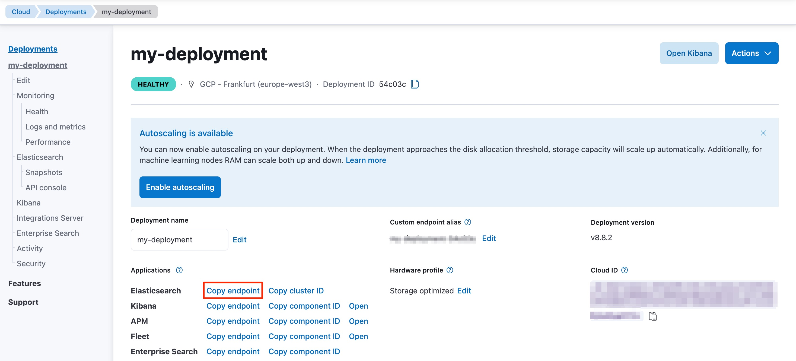
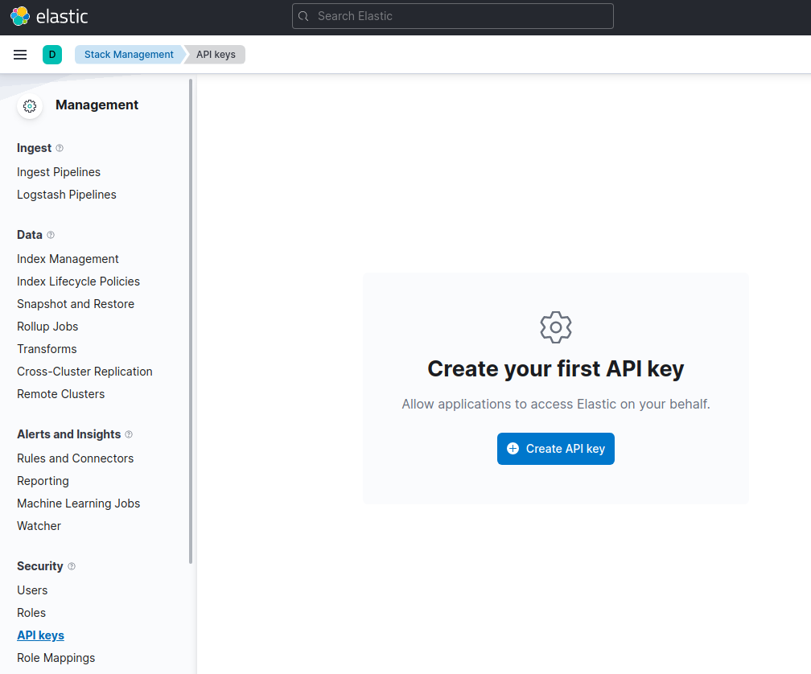

---
mapped_pages:
  - https://www.elastic.co/guide/en/elasticsearch/client/go-api/current/getting-started-go.html
---

# Getting started [getting-started-go]

This page guides you through the installation process of the Go client, shows you how to instantiate the client, and how to perform basic Elasticsearch operations with it. The examples use the [typed API](/reference/typed-api/index.md) with the [`esdsl`](/reference/typed-api/esdsl.md) query builders, which is the recommended way to use the client. If you need raw-JSON control or an endpoint not yet covered by the typed API, see the [low-level API](/reference/low-level-api/index.md).

## Requirements [_requirements]

Go version 1.24+

## Installation [_installation]

To install the latest version of the client, run the following command:

```shell subs=true
go get github.com/elastic/go-elasticsearch/v{{ version.elasticsearch-client-go | M }}@latest
```

Refer to the [_Installation_](/reference/installation.md) page to learn more.

## Connecting [_connecting]

Connect to Elastic Cloud using an API key and the Elasticsearch endpoint:

```go
client, err := elasticsearch.NewTyped(
    elasticsearch.WithCloudID("<CloudID>"), // <1>
    elasticsearch.WithAPIKey("<ApiKey>"),   // <2>
)
```

1. Your deployment's Cloud ID, found on the **My deployment** page.
2. Your API key for authentication.

Your Elasticsearch endpoint can be found on the **My deployment** page of your deployment:



You can generate an API key on the **Management** page under Security.



For other connection options, refer to the [_Connecting_](/reference/connecting.md) section.

## Operations [_operations]

Time to use Elasticsearch! This section walks you through the basic, and most important, operations of Elasticsearch. For more operations and more advanced examples, refer to the [Using the API](/reference/using-the-api/index.md) section.

:::::::::{stepper}

::::::::{step} Create an index

```go
client.Indices.Create("my_index").Do(context.TODO())
```

::::::::

::::::::{step} Index a document

```go
document := struct {
    Name string `json:"name"`
}{
    "go-elasticsearch",
}
client.Index("my_index").
    Id("1").
    Document(document).
    Do(context.TODO())
```

::::::::

::::::::{step} Get a document

```go
client.Get("my_index", "1").Do(context.TODO())
```

::::::::

::::::::{step} Search documents

Use the [`esdsl`](/reference/typed-api/esdsl.md) builders for a concise, fluent query syntax:

```go
client.Search().
    Index("my_index").
    Query(esdsl.NewMatchAllQuery()).
    Do(context.TODO())
```

::::::::

::::::::{step} Update a document

```go
client.Update("my_index", "1").
    Request(&update.Request{
        Doc: json.RawMessage(`{"language": "Go"}`),
    }).Do(context.TODO())
```

::::::::

::::::::{step} Delete a document

```go
client.Delete("my_index", "1").Do(context.TODO())
```

::::::::

::::::::{step} Delete an index

```go
client.Indices.Delete("my_index").Do(context.TODO())
```

::::::::

:::::::::

## Further reading [_further_reading]

- Learn more about the [_Typed API_](/reference/typed-api/index.md), a strongly typed Go API for {{es}}.
- Explore the [_esdsl builders_](/reference/typed-api/esdsl.md) for a fluent syntax to construct queries, aggregations, and mappings.
- If you need the low-level API or are migrating from it, see the [_Low-level API_](/reference/low-level-api/index.md) and the [_migration guide_](/reference/low-level-api/migration.md).
