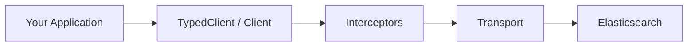

---
mapped_pages:
  - https://www.elastic.co/guide/en/elasticsearch/client/go-api/current/index.html
  - https://www.elastic.co/guide/en/elasticsearch/client/go-api/current/overview.html
---

# Go [overview]

This is the official Go client for {{es}}.

Full documentation is hosted at [GitHub](https://github.com/elastic/go-elasticsearch) and [PkgGoDev](https://pkg.go.dev/github.com/elastic/go-elasticsearch). This documentation provides only an overview of features.

## Features [_features]

- One-to-one mapping with REST API.
- Generalized, pluggable architecture.
- Two API styles: [low-level](using-the-api/index.md) and [fully typed](typed-api/index.md).
- [Fluent DSL builders](typed-api/esdsl.md) for constructing queries, aggregations, mappings, and sort options.
- Built-in [OpenTelemetry instrumentation](advanced/observability.md) for distributed tracing.
- [Interceptors](advanced/interceptors.md) for custom middleware (auth rotation, observability, etc.).
- Automatic retries, request compression, and node discovery.
- Helpers for convenience ([bulk indexing](using-the-api/bulk-indexing.md), JSON encoding, and more).
- Rich set of examples.

## Architecture [_architecture]

The client has a layered architecture where both the low-level and typed APIs share the same transport infrastructure:



The **transport layer** handles retry logic, request compression, node selection (round-robin), and connection pooling. **Interceptors** are optional middleware that can modify requests and responses (e.g., for dynamic authentication or custom logging). See the [Configuration reference](configuration.md) for all available options.

## Usage [_usage]

:::::::{tab-set}
:group: APIs
::::::{tab-item} Low-level API
:sync: lowLevel

```go subs=true
package main

import (
    "context"
    "log"

    "github.com/elastic/go-elasticsearch/v{{ version.elasticsearch-client-go | M }}"
)

func main() {
    es, _ := elasticsearch.New()
    defer es.Close(context.Background())

    res, err := es.Info()
    if err != nil {
        log.Fatal(err)
    }
    defer res.Body.Close()

    log.Println(res)
}
```

::::::

::::::{tab-item} Fully-typed API
:sync: typed

```go subs=true
package main

import (
    "context"
    "log"

    "github.com/elastic/go-elasticsearch/v{{ version.elasticsearch-client-go | M }}"
)

func main() {
    es, _ := elasticsearch.NewTyped(
        elasticsearch.WithAddresses("http://localhost:9200"),
    )
    defer es.Close(context.Background())
    log.Println(es.Info().Do(context.Background()))
}
```

::::::

:::::::

::::{note}
Please have a look at the collection of comprehensive examples in the repository at <https://github.com/elastic/go-elasticsearch/tree/main/_examples>.
::::

## Resources [_resources]

- [Source Code](https://github.com/elastic/go-elasticsearch)
- [API Documentation](https://pkg.go.dev/github.com/elastic/go-elasticsearch)
- [Examples and Recipes](https://github.com/elastic/go-elasticsearch/tree/main/_examples)

:::{dropdown} License
Copyright 2019 {{es}}.

Licensed under the Apache License, Version 2.0 (the "License"); you may not use this file except in compliance with the License. You may obtain a copy of the License at

```text
http://www.apache.org/licenses/LICENSE-2.0
```

Unless required by applicable law or agreed to in writing, software distributed under the License is distributed on an "AS IS" BASIS, WITHOUT WARRANTIES OR CONDITIONS OF ANY KIND, either express or implied. See the License for the specific language governing permissions and limitations under the License.
:::
