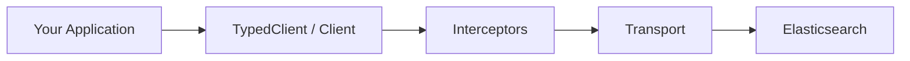

---
mapped_pages:
  - https://www.elastic.co/guide/en/elasticsearch/client/go-api/current/index.html
  - https://www.elastic.co/guide/en/elasticsearch/client/go-api/current/overview.html
---

# Go [overview]

This is the official Go client for {{es}}.

Full documentation is hosted at [GitHub](https://github.com/elastic/go-elasticsearch) and [PkgGoDev](https://pkg.go.dev/github.com/elastic/go-elasticsearch). This documentation provides only an overview of features.

## Features [_features]

- Strongly typed [typed API](typed-api/index.md) with compile-time safety and decoded responses.
- Fluent [esdsl builders](typed-api/esdsl.md) for queries, aggregations, mappings, and sort options.
- [Low-level API](low-level-api/index.md) for raw JSON control and endpoints not yet covered by the typed API.
- Built-in [OpenTelemetry instrumentation](advanced/observability.md) for distributed tracing.
- [Interceptors](advanced/interceptors.md) for custom middleware (auth rotation, observability, etc.).
- Automatic retries, request compression, and node discovery.
- Helpers for convenience ([bulk indexing](using-the-api/bulk-indexing.md), JSON encoding, and more).
- Rich set of examples.

## Architecture [_architecture]

The client has a layered architecture where the typed and low-level APIs share the same transport infrastructure:


```mermaid
graph LR
    App["Your Application"]
    TC["TypedClient / Client"]
    INT["Interceptors"]
    TP["Transport"]
    ES["Elasticsearch"]

    App --> TC
    TC --> INT
    INT --> TP
    TP --> ES
```

The **transport layer** handles retry logic, request compression, node selection (round-robin), and connection pooling. **Interceptors** are optional middleware that can modify requests and responses (e.g., for dynamic authentication or custom logging). See the [Configuration reference](configuration.md) for all available options.

## Usage [_usage]

The typed client combined with the `esdsl` builders is the recommended way to use this library:

```go subs=true
package main

import (
    "context"
    "fmt"
    "log"

    "github.com/elastic/go-elasticsearch/v{{ version.elasticsearch-client-go | M }}"
    "github.com/elastic/go-elasticsearch/v{{ version.elasticsearch-client-go | M }}/typedapi/esdsl"
)

func main() {
    es, err := elasticsearch.NewTyped(
        elasticsearch.WithAddresses("http://localhost:9200"),
    )
    if err != nil {
        log.Fatal(err)
    }
    defer es.Close(context.Background())

    res, err := es.Search().
        Index("my-index").
        Query(esdsl.NewMatchQuery("title", "golang")).
        Do(context.Background())
    if err != nil {
        log.Fatal(err)
    }

    for _, hit := range res.Hits.Hits {
        fmt.Println(hit.Source_)
    }
}
```

If you need raw JSON control or an endpoint the typed API does not yet cover, see the [low-level API](low-level-api/index.md). You can mix both styles in the same program: they share the same transport and can run against the same client. The [migration guide](low-level-api/migration.md) walks through moving existing low-level code to the typed API one endpoint at a time.

::::{note}
Please have a look at the collection of comprehensive examples in the repository at <https://github.com/elastic/go-elasticsearch/tree/main/_examples>.
::::

## Resources [_resources]

- [Source Code](https://github.com/elastic/go-elasticsearch)
- [API Documentation](https://pkg.go.dev/github.com/elastic/go-elasticsearch)
- [Examples and Recipes](https://github.com/elastic/go-elasticsearch/tree/main/_examples)

:::{dropdown} License
Copyright 2019 {{es}}.

Licensed under the Apache License, Version 2.0 (the "License"); you may not use this file except in compliance with the License. You may obtain a copy of the License at

```text
http://www.apache.org/licenses/LICENSE-2.0
```

Unless required by applicable law or agreed to in writing, software distributed under the License is distributed on an "AS IS" BASIS, WITHOUT WARRANTIES OR CONDITIONS OF ANY KIND, either express or implied. See the License for the specific language governing permissions and limitations under the License.
:::
