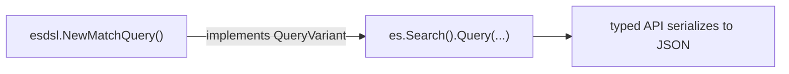

# esdsl -- Elasticsearch DSL builders [esdsl]

The `esdsl` package provides fluent, type-safe builders for constructing Elasticsearch queries, aggregations, mappings, and sort options. It is designed to work alongside the [typed API](index.md), giving you a concise, chainable syntax for building complex request bodies.

```go subs=true
import "github.com/elastic/go-elasticsearch/v{{ version.elasticsearch-client-go | M }}/typedapi/esdsl"
```

The package is generated from the [elasticsearch-specification](https://github.com/elastic/elasticsearch-specification), so every query type, aggregation, mapping property, and sort option available in {{es}} has a corresponding builder.

## Why use esdsl [_why_use_esdsl]

The typed API models requests as Go structs. This works well for simple operations, but deeply nested structures like bool queries with multiple clauses, aggregations with sub-aggregations, or complex mappings can become verbose:

```go
// Typed API with structs -- works, but verbose for complex queries
res, err := es.Search().
    Index("products").
    Request(&search.Request{
        Query: &types.Query{
            Bool: &types.BoolQuery{
                Must: []types.Query{
                    {Match: map[string]types.MatchQuery{
                        "title": {Query: "wireless"},
                    }},
                },
                Filter: []types.Query{
                    {Term: map[string]types.TermQuery{
                        "brand": {Value: "Samsung"},
                    }},
                },
            },
        },
    }).
    Do(context.Background())
```

The `esdsl` builders express the same intent in fewer lines, with each builder method guiding you through the available options:

```go
// esdsl -- same query, less nesting
res, err := es.Search().
    Index("products").
    Query(
        esdsl.NewBoolQuery().
            Must(esdsl.NewMatchQuery("title", "wireless")).
            Filter(esdsl.NewTermQuery("brand", esdsl.NewFieldValue().String("Samsung"))),
    ).
    Do(context.Background())
```

## How it works [_how_it_works]

Every `esdsl` builder follows the same pattern:

1. **Create** a builder with `NewXxx()`.
2. **Configure** it by chaining methods.
3. **Pass** it directly to a typed API method.

Under the hood, each builder wraps the corresponding `types.*` struct and implements a `*Variant` interface (such as `QueryVariant` or `AggregationsVariant`). The typed API methods accept these interfaces, so builders plug in directly without any manual conversion.



For example, the typed API `Search` endpoint accepts any `QueryVariant`:

```go
func (r *Search) Query(query types.QueryVariant) *Search
```

And every `esdsl` query builder implements `QueryVariant` through its `QueryCaster()` method:

```go
func (s *_matchQuery) QueryCaster() *types.Query
```

This means you never need to call the caster yourself -- just pass the builder directly.

## Builder categories [_builder_categories]

### Queries [_esdsl_queries]

Build any {{es}} query type with `NewXxxQuery()` constructors:

```go
// Simple match
esdsl.NewMatchQuery("title", "elasticsearch")

// Match all
esdsl.NewMatchAllQuery()

// Term (exact match)
esdsl.NewTermQuery("status", esdsl.NewFieldValue().String("published"))

// Range
esdsl.NewNumberRangeQuery("price").Gte(100).Lt(500)

// Bool (compound)
esdsl.NewBoolQuery().
    Must(
        esdsl.NewMatchQuery("title", "Go"),
        esdsl.NewNumberRangeQuery("year").Gte(2020),
    ).
    Filter(
        esdsl.NewTermQuery("lang", esdsl.NewFieldValue().String("go")),
    )
```

All query builders implement `QueryVariant`, so they work with `es.Search().Query(...)` and inside compound queries like `BoolQuery.Must(...)`.

### Aggregations [_esdsl_aggregations]

Build aggregations with `NewXxxAggregation()` constructors:

```go
// Sum aggregation
esdsl.NewSumAggregation().Field("price")

// Terms aggregation
esdsl.NewTermsAggregation().Field("category.keyword").Size(10)

// Average aggregation
esdsl.NewAverageAggregation().Field("rating")
```

Aggregation builders implement `AggregationsVariant`, so they work with `es.Search().AddAggregation(...)`:

```go
res, err := es.Search().
    Index("products").
    Size(0).
    AddAggregation("avg_price", esdsl.NewAverageAggregation().Field("price")).
    AddAggregation("by_brand", esdsl.NewTermsAggregation().Field("brand.keyword").Size(5)).
    Do(context.Background())
```

### Mappings [_esdsl_mappings]

Build index mappings with `NewTypeMapping()` and property builders:

```go
mappings := esdsl.NewTypeMapping().
    AddProperty("title", esdsl.NewTextProperty()).
    AddProperty("price", esdsl.NewIntegerNumberProperty()).
    AddProperty("tags", esdsl.NewKeywordProperty()).
    AddProperty("embedding", esdsl.NewDenseVectorProperty().
        Dims(768).
        Index(true).
        Similarity(densevectorsimilarity.Cosine))

res, err := es.Indices.Create("my-index").
    Mappings(mappings).
    Do(context.Background())
```

Mapping builders implement `TypeMappingVariant` and `PropertyVariant`, so they work with `Mappings(...)` and `AddProperty(...)`.

### Sort options [_esdsl_sort]

Build sort configurations with `NewSortOptions()` and `NewFieldSort()`:

```go
sort := esdsl.NewSortOptions().
    AddSortOption("_score", esdsl.NewFieldSort(sortorder.Desc)).
    AddSortOption("date", esdsl.NewFieldSort(sortorder.Asc))

res, err := es.Search().
    Index("articles").
    Query(esdsl.NewMatchQuery("title", "Go")).
    Sort(sort).
    Do(context.Background())
```

## When to use esdsl vs structs [_when_to_use]

| Scenario                                               | Recommended approach                 |
| ------------------------------------------------------ | ------------------------------------ |
| Complex, nested queries (bool, nested, function_score) | `esdsl` builders                     |
| Aggregations with sub-aggregations                     | `esdsl` builders                     |
| Index mappings with many fields                        | `esdsl` builders                     |
| Simple, flat requests (match_all, single term)         | Either -- both are concise           |
| Dynamic query construction at runtime                  | `esdsl` builders (easier to compose) |
| Pre-built JSON templates                               | `Raw()` method on the typed API      |

Both approaches produce identical JSON and share the same typed API transport. You can freely mix them in the same application.
