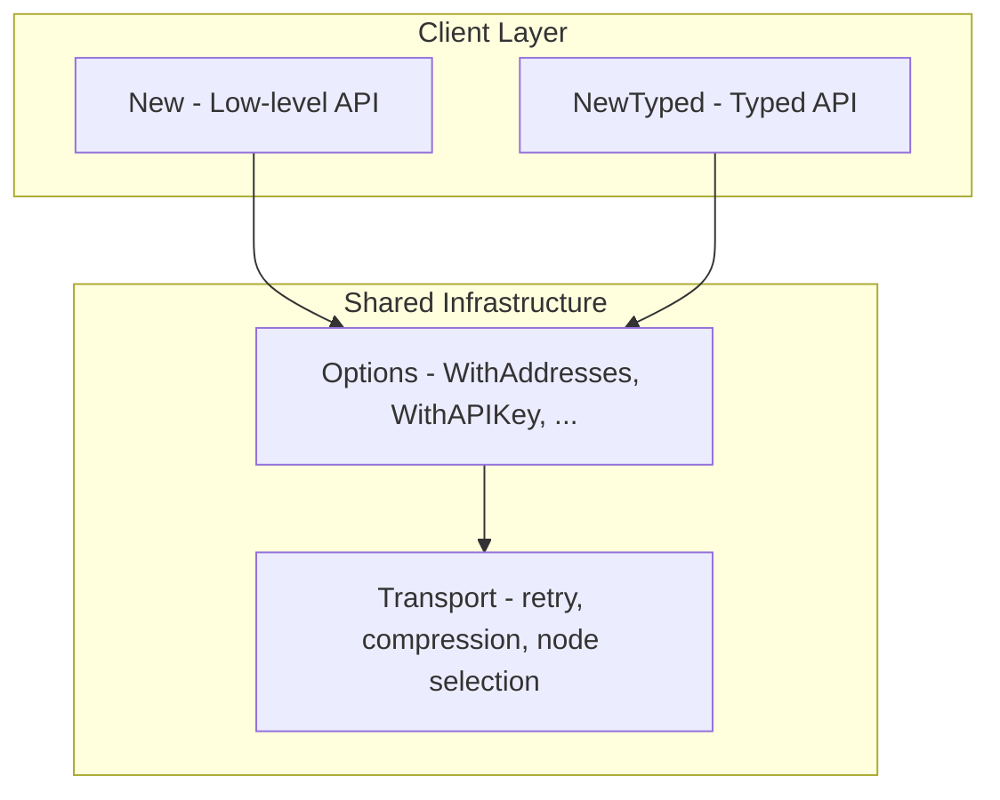
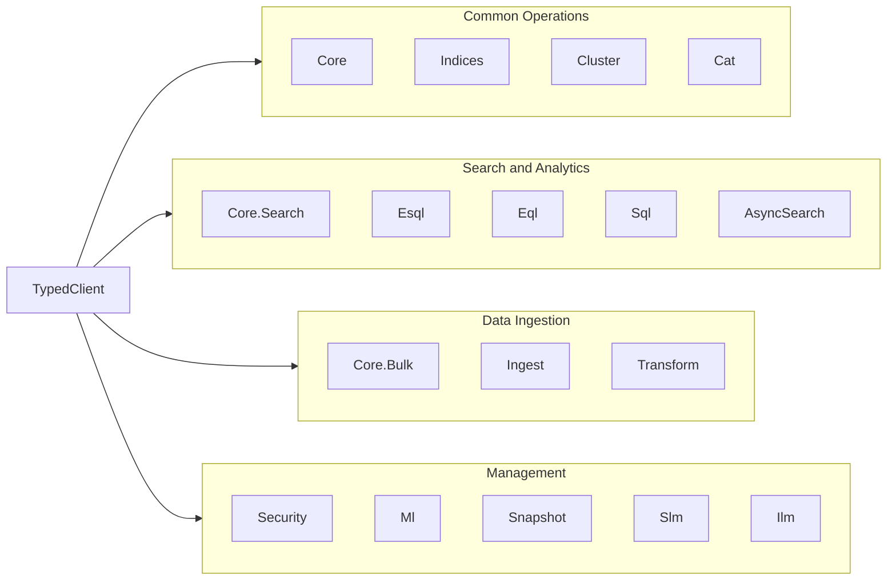

---
mapped_pages:
  - https://www.elastic.co/guide/en/elasticsearch/client/go-api/current/typedapi.html
  - https://www.elastic.co/guide/en/elasticsearch/client/go-api/current/_getting_started_with_the_api.html
---

# Typed API [typedapi]

The typed API provides a strongly typed Go API for {{es}}, designed with Go structs and the runtime in mind. Requests and responses are modeled as Go types, giving you compile-time safety, IDE autocompletion, and no need to manually parse JSON.

The code is generated from the [elasticsearch-specification](https://github.com/elastic/elasticsearch-specification).

## Getting started [_getting_started_with_the_api]

Create a typed client using the `NewTyped` function with option values:

```go
client, err := elasticsearch.NewTyped(
    elasticsearch.WithAddresses("https://localhost:9200"), // <1>
    elasticsearch.WithAPIKey("your-api-key"), // <2>
)
if err != nil {
    log.Fatal(err)
}
defer client.Close(context.Background()) // <3>
```

1. The Elasticsearch node URL(s).
2. Authentication credentials (API key, username/password, or service token).
3. Always close the client when done to release resources.

For full configuration options, see the [Configuration reference](../configuration.md).

## Relationship to the low-level client [_typed_api_relationship]

The typed client and the low-level client share the same underlying transport, configuration, and connection pool. The typed API is a higher-level abstraction built on top of the same infrastructure:



You can use both clients in the same application since they share the same transport. Choose the typed API for compile-time safety, or fall back to the low-level API for maximum flexibility.

## API namespaces [_typed_api_namespaces]

The typed client organizes {{es}} APIs into namespaces that mirror the REST API structure. Each namespace groups related operations:



Access API methods through the namespace fields on the client:

```go
// Indices namespace
client.Indices.Create("my-index").Do(context.Background())

// Cluster namespace
client.Cluster.Health().Do(context.Background())

// Core namespace (also available directly on the client)
client.Search().Index("my-index").Do(context.Background())

// Security namespace
client.Security.GetUser("admin").Do(context.Background())

// ML namespace
client.Ml.GetJobs().Do(context.Background())
```

The full list of namespaces includes:
`AsyncSearch`, `Autoscaling`, `Cat`, `Ccr`, `Cluster`, `Connector`, `Core`,
`DanglingIndices`, `Enrich`, `Eql`, `Esql`, `Features`, `Fleet`, `Graph`,
`Ilm`, `Indices`, `Inference`, `Ingest`, `License`, `Logstash`, `Migration`,
`Ml`, `Monitoring`, `Nodes`, `Profiling`, `QueryRules`, `Rollup`,
`SearchApplication`, `SearchableSnapshots`, `Security`, `Shutdown`, `Simulate`,
`Slm`, `Snapshot`, `Sql`, `Ssl`, `Streams`, `Synonyms`, `Tasks`,
`TextStructure`, `Transform`, `Watcher`, and `Xpack`.

## NDJSON endpoints [_ndjson_endpoints]

The typed API includes endpoints that use NDJSON bodies such as `bulk` and `msearch`.

For example, you can build a bulk request by appending operations and then executing it:

```go
client, err := elasticsearch.NewTyped(
    // Proper configuration for your Elasticsearch cluster.
)
if err != nil {
    // Handle error.
}

index := "my-index"
id := "1"
bulk := client.Bulk() // <1>
if err := bulk.IndexOp(types.IndexOperation{Index_: &index, Id_: &id}, map[string]any{"title": "Test"}); err != nil { // <2>
    // Handle error.
}

res, err := bulk.Do(context.Background()) // <3>
if err != nil {
    // Handle error.
}
if res.Errors {
    // One or more operations failed.
}
```

1. Create a bulk request builder.
2. Append an index operation with metadata and document body.
3. Execute the bulk request and check for errors.

## Raw payloads [_raw_payloads]

If you already have a newline-delimited JSON payload, you can submit it directly with `Raw(io.Reader)` on the request builder.

## Learn more [_typed_api_learn_more]

- [Conventions](conventions.md) — Naming, structure, enums, and unions in the typed API
- [esdsl builders](esdsl.md) — Fluent DSL builders for queries, aggregations, mappings, and sort options
- [Using the API](../using-the-api/index.md) — Practical examples comparing both API styles
